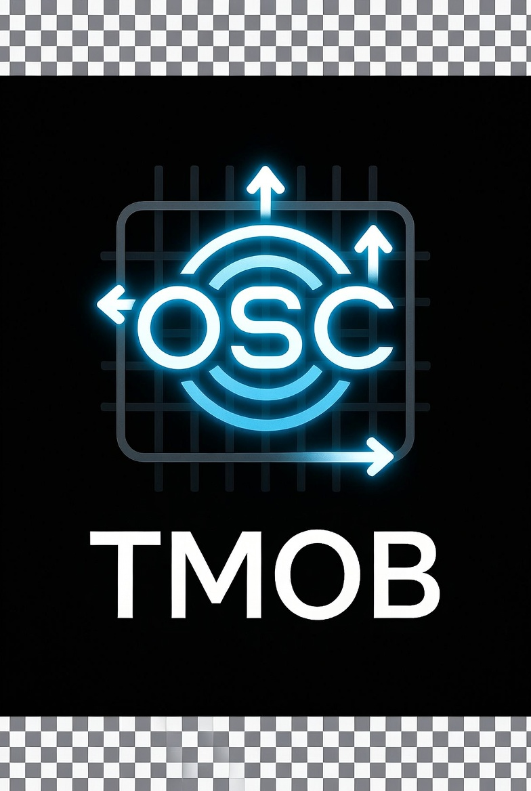

# TotalMix OSC Bridge

**Turn RME TotalMix FX into an instrument.** One MIDI knob or trigger fires a
macro: switch workspace and snapshot, ramp a send over four bars in time with
your sequencer clock, duck a return under a sidechain, open a filter - all
over OSC, with 32-bit floats instead of 128 MIDI steps. A signed Windows
installer, a Docker image, and a plain Python checkout all run the same code.

<p align="center"></p>

## Why

In a hardware-heavy studio the sends are set once and left alone. But
sometimes the send *is* the performance: a synth that blooms into the room on
a specific bar, a delay return that opens for the breakdown. TotalMix has no
way to do that from a controller, and MIDI CC is too coarse for an analog
send. This bridge adds the missing layer, and an LFO is just a very small
goblin turning the knob at exactly the right rate.

## The three pieces

| Piece | What it is | Where |
|---|---|---|
| **Bridge** (server) | Python service: macro + knob engine, Global OSC transport, web UI, REST/WebSocket API, MQTT | `tmosc/`, `web/` |
| **Tray agent** (client) | Native, dependency-free Windows/Linux program that reads your MIDI controller and drives the bridge with no browser open | `agent/` |
| **Installer** | One signed `tmosc-setup-<version>.exe`: Client, Server, or Both, with a config wizard | `installer/` |

## Quick start

### Windows installer (no Python, no Docker)

Download `tmosc-setup-<version>.exe` from
[Releases](https://github.com/auntiepickle/totalmix-osc-bridge/releases),
run it, pick **Client**, **Server**, or **Both**. The wizard asks for
TotalMix's IP, the ports and the transport (server; choose `global`) and
finds the bridge on your LAN and lists your MIDI inputs (client). Everything is Authenticode-signed.

### Docker (always-on server)

```bash
git clone https://github.com/auntiepickle/totalmix-osc-bridge.git
cd totalmix-osc-bridge
cp docker-compose.example.yml docker-compose.yml
printf 'OSC_IP=192.168.1.50\nOSC_TRANSPORT=global\nENABLE_MQTT=false\n' > .env   # your TotalMix PC; with a broker use MQTT_BROKER=<ip> instead of ENABLE_MQTT=false
cp examples/mappings.example.json mappings.json
cp examples/ufx2_channel_map.example.json ufx2_channel_map.json
cp examples/ufx2_snapshot_map.example.json ufx2_snapshot_map.json   # workspace/snapshot switching needs it
docker compose build && docker compose up -d
```

### From source

```bash
python -m venv .venv && source .venv/bin/activate     # .venv\Scripts\activate on Windows
pip install -r requirements.txt
cp examples/mappings.example.json mappings.json
OSC_IP=127.0.0.1 OSC_TRANSPORT=global ENABLE_MQTT=false python -m tmosc   # web UI on http://localhost:8088
```

Then point TotalMix at the bridge (**Options > Mixer Settings > OSC**):
Remote 2 = Global OSC, port incoming `7002`, port outgoing `9002`, remote IP =
the bridge machine (TotalMix FX 2.1+; this is the standard transport). Keep
Remote 1 configured too (classic, `7001` / `9001`): it still performs workspace
and snapshot switching. Step by step in
[docs/setup.md](docs/setup.md#totalmix-osc-configuration-the-canonical-client-setup).

## How it fits together

```
MIDI controller ─┬─ tray agent (native, headless) ──┐
                 └─ browser (Web MIDI, optional)  ──┤ HTTP / WebSocket
                                                    v
Home Assistant ── MQTT ──────────────────────>  BRIDGE  ── Global OSC (UDP) ──> TotalMix FX
                                                    ^                               │
                                          web UI <──┴──── feedback listener <───────┘
```

- The **bridge** resolves macro targets by *name* ("AN 3 -> RE-150 In") against
  a channel map it learns from the device, so nothing breaks when strips move.
- **Knobs** are continuous controls with a range guard, section auto-enable,
  device-side sync (move the fader in TotalMix and every view follows), and a
  retained MQTT state topic for a phone slider.
- The **tray agent** owns the MIDI port; an open browser yields to it and
  stays a live monitor. The agent and the installer wizard find the bridge by
  LAN auto-discovery.

## Features

- **Macros** with ramp and LFO operations timed in bars against the live MIDI
  clock, fire modes (`ignore`, `queue`, `restart`), workspace and snapshot
  switching that only switches when needed.
- **Knobs**: EQ, cuts, gain, pan, sends, VCA-style send groups, sidechain
  ducking, filter-curve display, and the Home Assistant slider.
- **Live web UI** with card, rack, and the MODUL instrument layout; every
  change is hot-reloaded and auto-backed up.
- **Device discovery**: the bridge reads TotalMix's feedback and builds the
  channel map itself.
- **MQTT / Home Assistant**: trigger macros, follow workspace state, control
  knobs from a dashboard.
- **Signed, dependency-free Windows builds** for both client and server.

## Configuration

| File | Purpose |
|---|---|
| `mappings.json` | Macro and knob definitions (`examples/mappings.example.json`) |
| `ufx2_channel_map.json` | Channel names and the measured physical table |
| `ufx2_snapshot_map.json` | Workspace names to Quick Select slots and snapshot names |
| `config.env` or environment | `OSC_IP`, ports, transport, MQTT - see [docs/setup.md](docs/setup.md#environment-variables) |

From source and in Docker these live in the repo root; the Windows installer
keeps them in `%APPDATA%\tmosc-bridge`. Schemas: [docs/config.md](docs/config.md).

## Repository layout

```
tmosc/            the server package (python -m tmosc): bridge.py engine, api/ (FastAPI),
                  OSC transports + listeners, MQTT, discovery, duck engine, app_paths
web/              browser UI (web/static) + the web.web_client compatibility shim
agent/            native C MIDI client: portable core, Linux daemon, Windows tray
installer/        Inno Setup unified installer (Client / Server / Both)
deploy/           Docker entrypoint, Caddy HTTPS front, Home Assistant package
docker-compose.example.yml  runnable compose file (copy or `-f` it)
examples/         *.example.json templates
tools/            dev + hardware helpers, frozen-build smoke test, manual rig scripts
tests/            pytest suite (no hardware needed)
docs/             setup, config, architecture, security, Home Assistant, design notes, history
Dockerfile        server image (Tailwind build stage + Python runtime)
tmosc-bridge.spec PyInstaller spec for the frozen Windows server
```

## Development

```bash
pip install -r requirements.txt -r requirements-dev.txt
pytest                                   # 270+ tests, ~30 s, no hardware
docker build -t tmosc .                  # what CI builds
pip install -r requirements-frozen.txt && pyinstaller --noconfirm tmosc-bridge.spec
pwsh tools/smoke_frozen.ps1              # boots dist/tmosc-bridge/tmosc-bridge.exe and checks it
```

Releases: push a tag `v1.2.3`; `.github/workflows/release.yml` builds and
signs the agent, the frozen bridge, and the installer, then publishes them.

## Documentation

| Doc | Contents |
|---|---|
| [docs/setup.md](docs/setup.md) | Windows installer, Docker, source install, env vars, HTTPS, TotalMix OSC settings |
| [docs/config.md](docs/config.md) | Full schema of the three config files |
| [docs/architecture.md](docs/architecture.md) | Modules, transports, thread model, frontend patterns |
| [docs/home-assistant.md](docs/home-assistant.md) | MQTT topics and the phone knob |
| [docs/security.md](docs/security.md) | Locking the control API down (`API_TOKEN`) |
| [docs/known-limitations.md](docs/known-limitations.md) | Honest edges |
| [agent/README.md](agent/README.md) | The tray agent: install, config, coexistence, build |
| [CHANGELOG.md](CHANGELOG.md) | What changed, and why |

## Status

Used daily on a UFX II rig with the Global OSC transport. The classic OSC
transport (TotalMix's remote 1, relative addressing) is kept for workspace and
snapshot switching and device sweeps but is legacy for everything else.
License: not yet chosen; open an issue if you need one before it lands.
